PRODUCTO FINAL: "Red Social"
======================================
## SQUAD: LAS CAPUCCINAS

## GRUPO: NETWORKING GIRLS

## INTEGRANTES:  
- Lara Aspilcueta, Betsy Dessire - betsy_dessire@hotmail.com
- Quiñones Jauregui,Yenny Elizabeth - yenny.quinones.jauregui@gmail.com
- Yauri Machaca , Melissa Rossmery - yaurimelissa@gmail.com

## PROBLEMA
- Problema o Requerimiento: Ausencia de una Red Social exclusiva para ofertar oficios, demandar servicios y
anunciar productos relacionados.

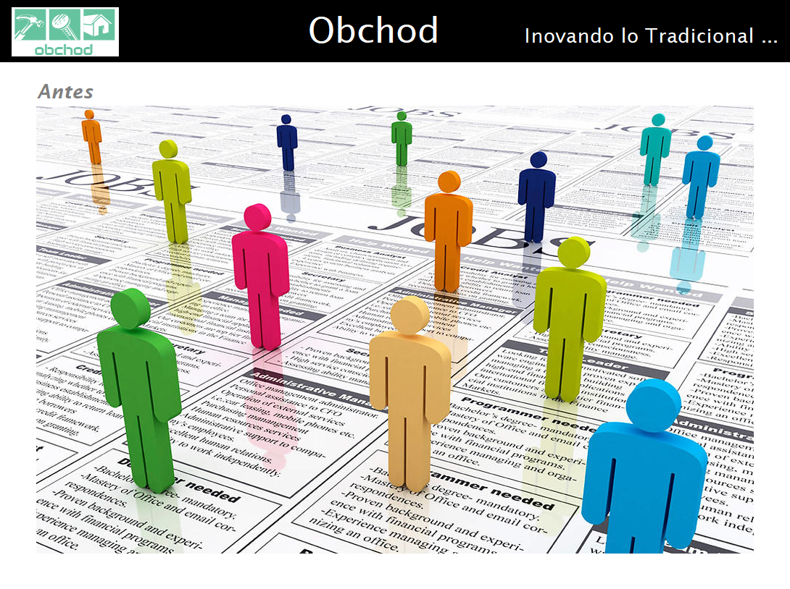

## SOLUCIÓN : RED SOCIAL OBCHOD

### LOGO

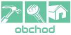

### FAST VIEW
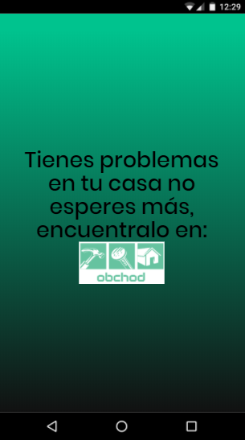

## BREVE EXPLICACION:
- Obchod, es una Red Social, con accesibilidad vía web ( link gh-pages ) y mobile, que tiene la finalidad de facilitar los puntos de contactos entre: personas que tienen un oficio, clientes que solicitan  servicios y proveedores que ofertan sus productos relacionados.

## PROTOTIPO :
### GLOBAL VIEW
----------------------
* Vista Opciones: Esta vista consiste en definir si deseas algun servicio o quieres ofrecerlo.
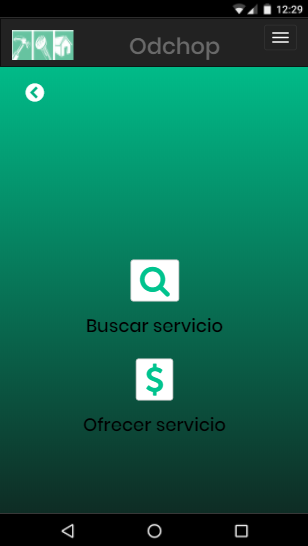

* Vista orientadas al cliente

- Vista Oficios: El cliente podrá buscar el servicio que requiera.
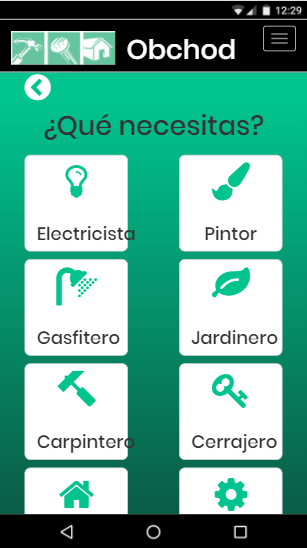

- Vista home: Esta vista te permite postear y además te muestra todas las personas que tienen el servicio que solicitaste.Y asimismo muestra una lista de proveedores que es orientado al que ofrece su servicio.
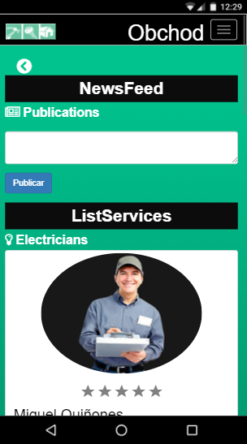

-Vista Profile: Esta vista te permite ver todos los datos de la persona que ofrece el servicio.
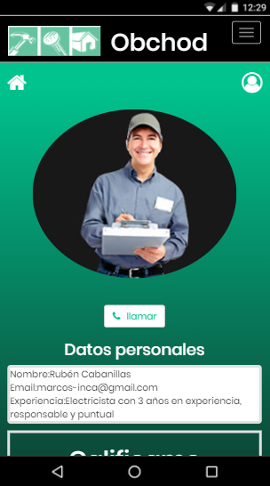

 En ello también te permite calificarlo
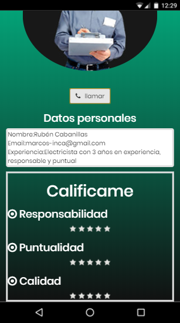

 Y si deseas adquirir el servicio es necesario registrarte
 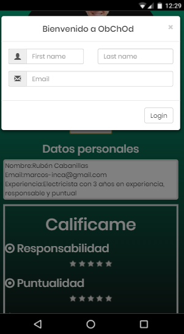

 Es totalmente indispensable sino sale un mensaje de alerta

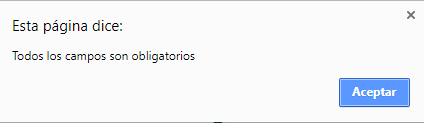

Y finalmente te muestra el número telefonico para que lo contactes
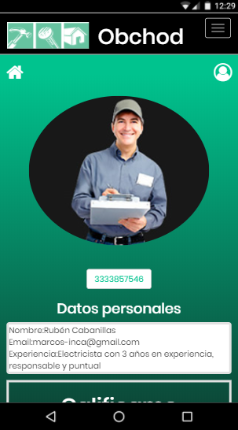

* Vista orientadas al que brinda el servicio
- Vista Ingresar: Esta vista te permite tanto ingresar
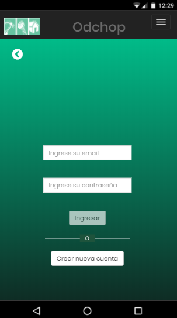

 Y también registrarte
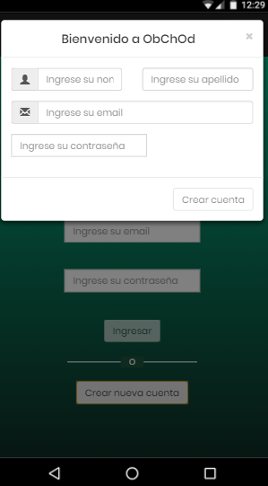

- Vistta Profile: Esta vista permite tener un perfil al que ofrece el servicio
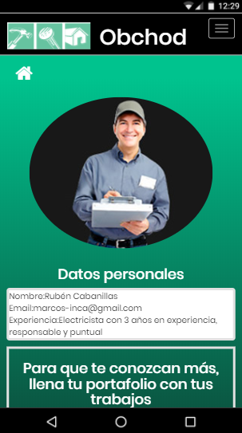

Y para que el cliente conosca los trabajos que realiza el que ofrece el servicio.Se incorpora una sección para subir sus fotos.
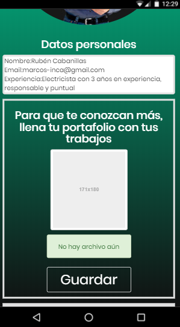

Tanto para el cliente como para la persona que ofrece el servicio tienen un vista en común llamada vista home.

## DETALLE
En la presente versión solo se esta considerando la funcionalidad para un oficio que es el electricista.

## ANEXOS
- Modelo Cuestionario de Entrevista Presencial a Electricista
  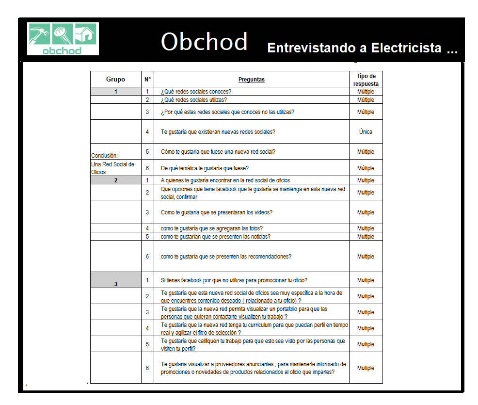
  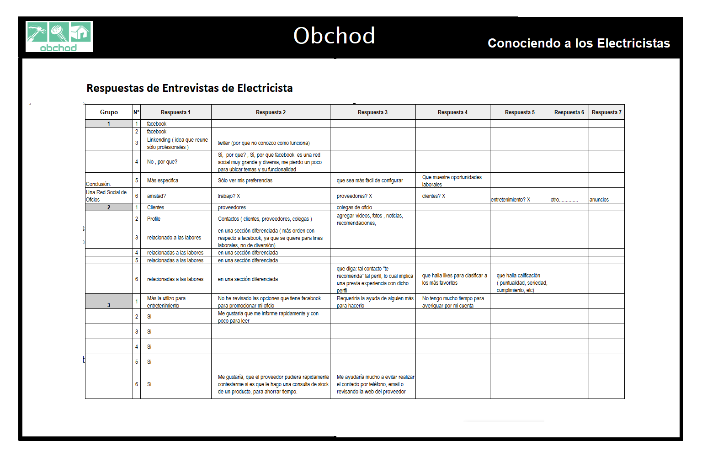

- Modelo Cuestionario de Encuesta a Posibles Clientes
  [Encuesta]( https://goo.gl/forms/7RBTRfiR6nP1VR2v2 "Encuestando a Posibles Clientes").

- Modelo Cuestionario de Entrevista Presencial a Posibles Proveedores
  

## PLANEACIÓN DEL PROYECTO
###
### Link
### Tecnología
- Trello

## ETAPAS DE IMPLEMENTACIÓN DEL PROYECTO

### ETAPA USER EXPERIENCIE - UX

#### EMPATIZANDO - IDENTIFICANDO LA NECESIDAD
Se han identificado la historia real de un electricita, y a través de entrevistas
se han identificado sus necesidades.

##### Entrevista:
- Entrevista Presencial a Electricista
  Se le hizo 3 entrevistas a un mismo Electricista,
  Se prepararon 3 grupos de preguntas
  Se obtuvieron las siguientes primeras conclusiones

- Encuesta Online a Posibles Clientes:
  Se encuestó a 27 personas
  Teniendo los siguientes resultados

  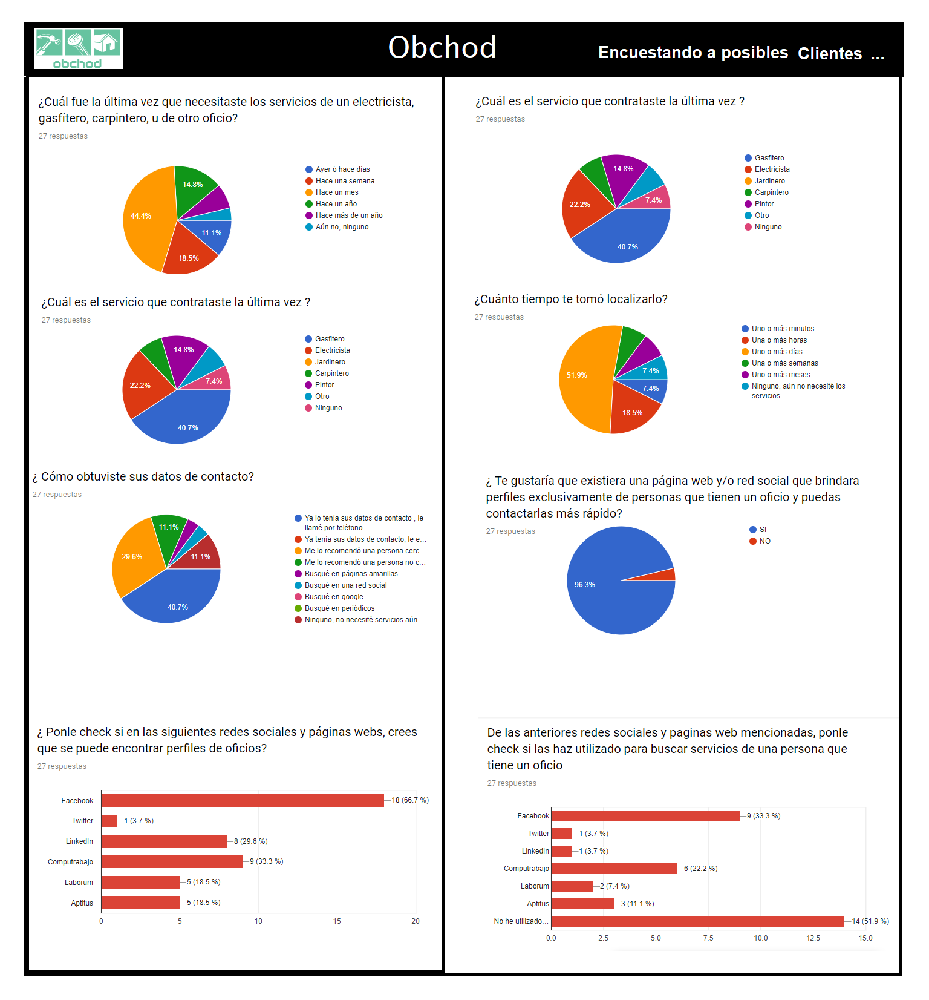
  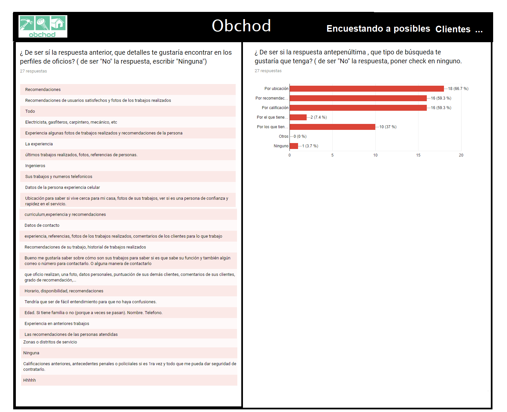

- Encuesta Presencial a Proveedor
  Se elaboró un modelo de entrevista a un proveedor

##### Primeras Conclusiones:
- Falta de punto de contacto entre personas que tienen un oficio, clientes y proveedores
- Ausencia de una Red Social de Oficios.

#### PROFUNDIZANDO - CONOCIENDO MÁS
Se entabló una conversación más profunda de los entrevistados, aparte de los cuestionarios,
y se pudo conocer sus historias.
##### Historias:
 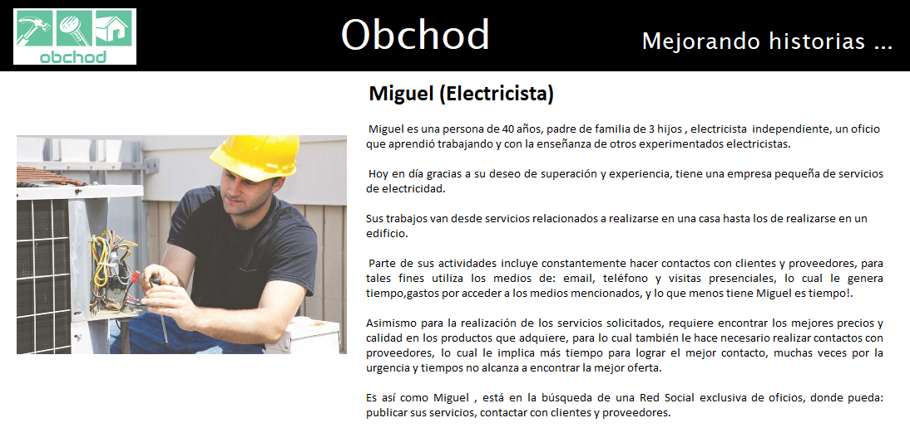
 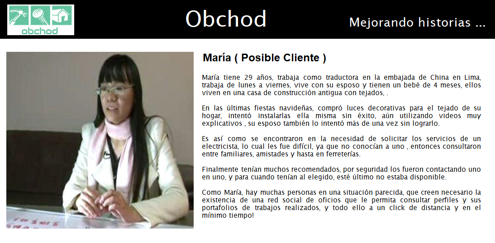
 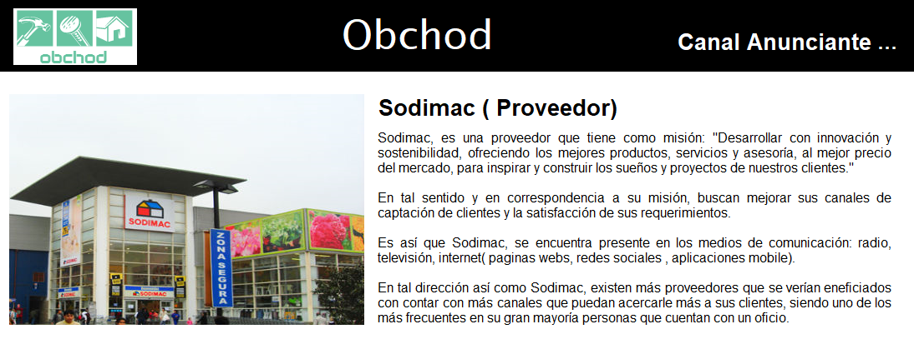

##### Metas y Deseos ( electricista, cliente y proveedor)
Electricista |    Cliente   | Proveedor
------------ | -------------|--------------
Aumentar contactos con clientes | visualizar perfiles|más clientes
reducir el tiempo de contacto| recibir , calificar y recomendar un buen servicio|
conocer los anuncios de los proveedores rápidamente|ubicar rápidamente|que conozcan rápidamente la información de sus productos.

#### INVESTIGANDO
##### Oficio Definición
##### Oficio Electricidad
##### Páginas Webs y Redes Sociales actuales
- Facebook
- Twitter
- Linkdln
- Aptitus.com
- Computrabajo.com
- Laborum.com
##### Estadísticas

#### SKETCHS

#### PRODUCCIÓN

### ETAPA FRONT END

#### TECNOLOGÍA
- Css
- Javascript
- Jquery
- Boostrap
- Html
- Markdown

## CONCLUSIONES

## FEEDBACK
- Comunicarse con el grupo a los emails señalados, todo feedback será bien recibido.
